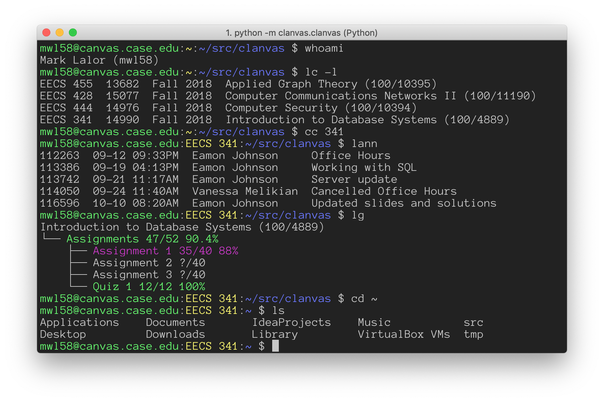

[](https://pypi.python.org/pypi/clanvas)
[](https://travis-ci.org/marklalor/clanvas)

# Clanvas
Command-line shell client for the [Canvas Learning Management System](https://github.com/instructure/canvas-lms)



### Available Commands

In the Clanvas shell, all commands already on your system `PATH` are available.
You can `ls` and `grep` as you please.

In addition, the shell provides the following commands:

|  Command  | Meaning                         |
|-----------|---------------------------------|
| lc        | list classes                    |
| cc        | change current class            |
| la        | list assignments                |
| lg        | list grades                     |
| lann      | list announcements              |
| catann    | print announcements             |
| pullf     | pull course files               |
| ua        | upload submission to assignment |
| wopen     | open in web interface           |
| whoami    | show login info                 |
| quit      | quit the shell                  |

Type `help` to see all commands, and use the `-h` flag to show usage details for any particular command.

### Installation

Clanvas is hosted on [PyPi](https://pypi.python.org/pypi/clanvas) and can be installed with `pip`.

Clanvas requires Python 3.6+

```
pip install clanvas
```

The `clanvas` command should now be on your path!

Usage will also require [generating a Canvas API token](#generating-an-api-token) which will be used to log in.

##### Note: in order to have 100% proper line editing and tab completion support, further configuration may be required.

Clanvas relies on the capabilities provided by `GNU readline` or an equivalent library. The situation varies by system.

|         |                                                                                                                                                                                                                                                                                                                                                                                                                                                                                                 |
|---------|-------------------------------------------------------------------------------------------------------------------------------------------------------------------------------------------------------------------------------------------------------------------------------------------------------------------------------------------------------------------------------------------------------------------------------------------------------------------------------------------------|
| Linux   | `GNU readline` is most likely already installed, no further configuration required.                                                                                                                                                                                                                                                                                                                                                                                                             |
| macOS   | Apple ships it's operating system with the BSD-licensed `editline` since `GNU readline` is released under a GPL (copyleft) license. By default, Clanvas will try to use `editline` if this is what is available. However, certain features like navigating previous commands and tab completion may not work correctly in all cases. The best/recommended solution is to ensure you are using Python with `GNU readline`. See [GNU readline on macOS](#gnu-readline-on-macos) for more details. |
| Windows | Currently Windows is untested, but the we recommend installing the `pyreadline` Python module.                                                                                                                                                                                                                                                                                                                                                                                                  |

### Login
Start the Clanvas shell by providing a config entry or URL.

For example, with the following config file at `~/.clanvas/config`...
```
Host school
	Url https://canvas.school.edu
	Token bOYc5cOIldA3eB9NTr7X0Um9Z8TPMACb0HtdgHTMtp10T5UKH0b4HOqTmOCvWZlYRpJ9dN
```

...login can be done with the hostname `school`
```
$ clanvas school 
bmr23@canvas.school.edu:~:~ $
```

Otherwise, if a URL can is provided then you are prompted for an access token:
```
$ clanvas https://canvas.school.edu
Enter access token: 
```

See [Generating an API Token](#generating-an-api-token) for more info on the access token.

### Example Usage

Run commands
```
bmr23@canvas.school.edu:~:~ $ lc -l
EECS 325  7832  Spring 2018  Computer Networks (100/5013)
EECS 338  6939  Spring 2018  Operating Systems (100/4593)
EECS 391  7136  Spring 2018  Artificial Intelligence (100/4163)
EECS 345  6937  Spring 2018  Programming Language Concepts (100/4699)
bmr23@canvas.school.edu:~:~ $ cc 325
bmr23@canvas.school.edu:EECS 325:~ $ lg -g
Computer Networks (100/5013)
├── Quizzes
│   ├── Quiz 1 100/100 100%
│   ├── Quiz 2 85/100 85%
│   └── Quiz 3 95/100 95%
├── Exams
│   └── Exam 1 86/100 86%
└── Homework
    ├── HW 1 20/20 100%
    ├── HW 2 18/20 90%
    └── HW 3 17/20 85%
bmr23@canvas.school.edu:EECS 325:~ $ pullf
bmr23@canvas.school.edu:EECS 325:~ $ tree ~/canvas/courses/EECS325-7832/files
/home/bob/canvas/courses/EECS325-7832/files
├── HW1_2018S.pdf
├── HW2_2018S.pdf
├── HW3-2018S.pdf
├── HW Solutions
│   └── HW1_2018S_Solutions
├── Lecture Notes
│   ├── Lecture1.ppt
│   ├── Lecture2.ppt
│   ├── Lecture3_Layering_AppLayerOverview.ppt
│   ├── Lecture4_5_Web.ppt
│   ├── Lecture6_DNS_CDN.ppt
│   ├── Lecture7_SMTP_P2P_SPAM.ppt
│   ├── Lecture8-Sockets_TransportIntro.ppt
│   └── Lecture9-UDP_RelXmit.ppt
├── Project1Files.zip
├── Project1Instructions.pdf
└── Syllabus.pdf
```

### Generating an API Token
1. Navigate to /profile/settings
2. Under the "Approved Integrations" section, click the button to generate a new access token.
3. Once the token is generated, you cannot view it again, so you'll have to generate a new token if it is lost.

### GNU readline on macOS

To check which line editor library your current python is using, check the output of

```
echo "import readline\nprint(readline.__doc__)" | python
```

You should see one of the following messages.
```
Importing this module enables command line editing using GNU readline.
Importing this module enables command line editing using libedit readline.
```

If you see the first message, you are good to go!

If you see the latter, the easiest fix is to install and configure `Anaconda`, a package manager that provides a Python distribution that comes with `GNU readline` set up as the command line editor.

Install `Anaconda`
```
$ brew cask install anaconda
```

Add Anaconda binaries to your path by amending your `~/.bash_profile` or `~/.zshrc` file
```
# At some point after your PATH is defined...
export PATH=/usr/local/anaconda3/bin:"$PATH"
```

Save and then source your edited rc file with `source ~/.zshrc` or equivalent (or restart your terminal).

**Now `Anaconda`'s commands are available to use!**

Create a new virtual environment
```
$ conda create --name py36 python=3.6
```

Now, somewhere after the `export PATH=/usr/local/anaconda3/bin:"$PATH"` line in your rc file, add the following line:
```
source activate py36
```
Save your rc file, and once again `source ~/.zshrc` or equivalent.

Check your Python version, you should see `Anaconda, Inc.` in the name.
```
$ python --version
Python 3.6.4 :: Anaconda, Inc.
```

Now check if `GNU readline` is being used
```
$ echo "import readline\nprint(readline.__doc__)" | python
Importing this module enables command line editing using GNU readline.
```

Congratulations, you have installed and set up a Python distribution with `GNU readline`!

Run `pip install clanvas` to celebrate.

## Contributing

Pull requests are welcome! Check out the [contributing](CONTRIBUTING.md) page for details
on how to help.

## Built With
These projects are used very directly, and both welcome pull requests. If you want to add an uncovered
canvas endpoint, or change the behavior of the shell itself, check out these projects: 
* [cmd2 (shell functionality)](https://github.com/python-cmd2/cmd2)
* [canvasapi (canvas lms api wrapper)](https://github.com/ucfopen/canvasapi)

## License

This project is licensed under the MIT License. See the [LICENSE](LICENSE) file for details.
